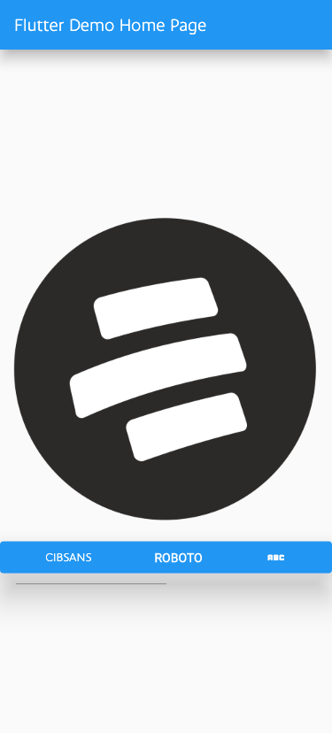
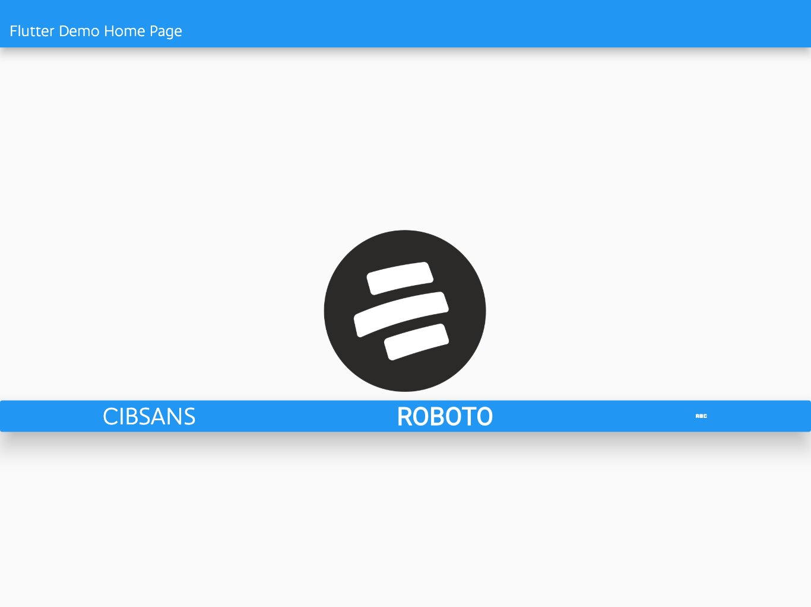
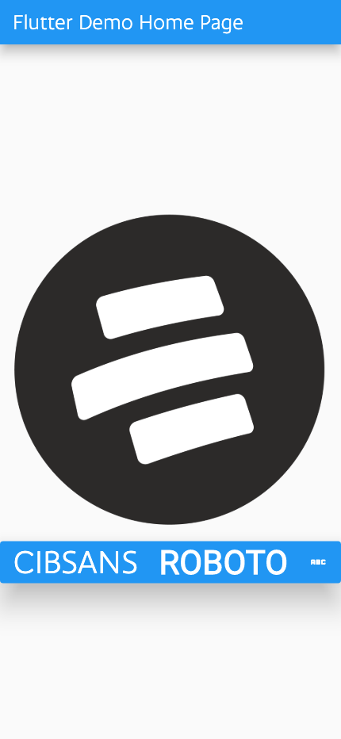

# ⚜️ bc_golden_plugin ⚜️

## A flutter package for automated visual QA.

This is a package that improves native golden tests and adds features according to needings in our development process, such as automating the visual QA manual process.

Also, it is heavily inspired by other packages like [golden_toolkit](https://pub.dev/packages/golden_toolkit) and [alchemist](https://github.com/Betterment/alchemist).

> An example of the usage can be found in the example directory.

### Contents
* Use cases. 👨🏻‍💻
* Guidelines. 📝
* BcGoldenConfiguration. 🛠
* Window configuration. 📱
* Custom Window Configuration.
* Accessibility. 🦾
* BcGoldenCapture (New Unified API). ⭐
* bcGoldenTest (Legacy). 🏗
* Multi-Step Golden Testing. 🎬
* LocalFileComparatorThreshold. 📈
* Example of usage 🤌🏻.


## Use cases 👨🏻‍💻
The main focus of this package is to compare either components or widgets against the designs provided by the Designers Team in Figma. So, to achieve this approach, we've take the native golden test tool and added some features that are going to be explained below.

Let's start with an example of use case, consider the following design:


Normally we need to schedule a review with someone of the design team to make a quality assurance, this could increase the time to market while waiting for that meeting. So, in solution to this problematic, we've come to the conclusion that we could use the **Golden Image Testing** but with a different approach.

So now consider the following image as the result of the development process:


As you can see there are actually visual differences.

## Guidelines 📝
* The tests folder should be inside the package *test folder*.
* The test should be named with *_golden_test.dart* notation.

## BcGoldenConfiguration. 🛠
The BcGoldenConfiguration handles the theme provider and theme data used by the application, so in here you can set your themes to run the tests. You could set this configuration in the **flutter_test_config.dart** like the following: 

```dart
Future<void> testExecutable(FutureOr<void> Function() testMain) async {
  TestWidgetsFlutterBinding.ensureInitialized();

  BcGoldenConfiguration bcGoldenConfiguration = BcGoldenConfiguration();

  bcGoldenConfiguration.setThemeProvider = [
    ChangeNotifierProvider(create: (_) => BcThemeNotifier()),
    ...BancolombiaFoundations.themeProvider,
  ];

  bcGoldenConfiguration.setThemeData = BcThemeData.lightTheme;

  await loadConfiguration();

  await testMain();
}
```
Or you can also do it by each tests case if you want.

## Window Configuration | Devices 📱
The following are the windows configurations that are available in the package to simulate a physical device:

| name  | viewport size | pixel ratio |
| ----- | ---- | ------------  |
| `iPhone 8` | 375 x 667 | 2.0
| `iPhone 13` | 390 x 844 | 3.0
| `iPhone 14 Pro max` | 430 x 932 | 3.0
| `Pixel 5` | 360 x 764 | 3.0
| `iPad Pro` | 1366 x 1024 | 2.0

Here are some examples of how are goldens rendered:
| device  | example | 
| ----- | ---- | 
| `iPhone 8` | | 
| `iPad Pro` | | 


## Custom Window Configuration 
You can also use a custom window configuration if none of the above are useful for you, here is an example: 

```dart
bcGoldenTest(
    'Test con custom window config data',
    (tester) async {
      await bcWidgetMatchesImage(
        imageName: 'golden',
        widget: const HomePage(title: "Flutter Demo Home Page"),
        tester: tester,
        device: bcCustomWindowConfigData(
          name: 'Custom Configuraton',
          pixelDensity: 3.0,
          size: const Size(375, 828),
        ),
      );
    },
  );

```


## Accessibility. 🦾
For testing accesibility there is a `textScaleFactor`parameter that will increase the font size depending in the given number, for example:

| iPhone14 normal  | iPhone14 with text scale factor | 
| ----- | ---- | 
|  |  |


## BcGoldenCapture (New Unified API) ⭐

The new `BcGoldenCapture` class provides a unified API for golden testing with both single widget captures and multi-step flow captures. This is the recommended approach for new tests.

### Single Widget Testing

For individual widget tests, use `BcGoldenCapture.single`:

```dart
BcGoldenCapture.single(
  'My widget test',
  (tester) async {
    await tester.pumpWidget(MyWidget());
    await expectLater(
      find.byType(MyWidget),
      matchesGoldenFile('goldens/my_widget.png'),
    );
  },
  shouldUseRealShadows: true,
);
```

### Multi-Step Flow Testing

For testing complete user flows with multiple screens, use `BcGoldenCapture.multiple`:

```dart
BcGoldenCapture.multiple(
  'User login flow',
  [
    GoldenStep(
      stepName: 'Login Screen',
      widgetBuilder: () => LoginScreen(),
      setupAction: (tester) async {
        // Setup actions before screenshot
      },
    ),
    GoldenStep(
      stepName: 'Dashboard',
      widgetBuilder: () => DashboardScreen(),
      verifyAction: (tester) async {
        // Verification actions after screenshot
      },
    ),
  ],
  const GoldenCaptureConfig(
    testName: 'user_login_flow',
    layoutType: CaptureLayoutType.vertical,
    spacing: 16.0,
  ),
);
```

### Configuration Options

The `GoldenCaptureConfig` class allows you to customize how multiple screenshots are combined:

- `testName`: Name of the golden file
- `layoutType`: How screenshots are arranged (`vertical`, `horizontal`, `grid`)
- `spacing`: Space between screenshots
- `maxScreensPerRow`: Maximum screenshots per row (for grid layout)
- `device`: Optional device configuration

### Animation Testing 🎬

For testing animations at specific timestamps, use `BcGoldenCapture.animation`:

```dart
BcGoldenCapture.animation(
  'Button scale animation',
  AnimatedButton(),
  [
    GoldenAnimationStep(
      timestamp: Duration.zero,
      frameName: 'start',
    ),
    GoldenAnimationStep(
      timestamp: Duration(milliseconds: 150),
      frameName: 'scaled',
    ),
    GoldenAnimationStep(
      timestamp: Duration(milliseconds: 300),
      frameName: 'end',
    ),
  ],
  GoldenAnimationConfig(
    testName: 'button_animation',
    totalDuration: Duration(milliseconds: 300),
    animationSteps: [...], // Same steps as above
    layoutType: CaptureLayoutType.horizontal,
    showTimelineLabels: true,
  ),
  animationSetup: (tester) async {
    // Trigger the animation
    await tester.tap(find.byType(AnimatedButton));
    await tester.pump();
  },
);
```

The animation testing feature captures frames at specific moments in your animation timeline, creating a comprehensive visual test that shows the animation's progression. This is particularly useful for:

- **UI Transitions**: Validating smooth transitions between states
- **Loading Animations**: Ensuring consistent spinner or progress animations

## bcGoldenTest (Legacy) 🏗
The is a legacy function that is still supported but deprecated. For new tests, please use `BcGoldenCapture.single` instead. This function is default tagged with "golden" and also has additional features for the tests, see the code below:

```dart
/// ## bcGoldenTest
/// Function to call the golden test, it replaces the testWigets. This functions
/// are tagged with 'golden'.
///
/// * [description] A brief description of the test,
/// * [test] The test itself,
/// * [shouldUseRealShadows] Whether to render shadows or not,
@isTest
void bcGoldenTest(
  String description,
  Future<void> Function(WidgetTester) test, {
  bool shouldUseRealShadows = false,
}) {
  testWidgets(
    description,
    (widgetTester) async {
      body() async {
        final initialDebugDisableShadowsValue = debugDisableShadows;
        debugDisableShadows = !shouldUseRealShadows;
        try {
          await test(widgetTester);
        } finally {
          debugDisableShadows = initialDebugDisableShadowsValue;
          debugDefaultTargetPlatformOverride = null;
        }
      }

      await body();
    },
    tags: ['golden'],
  );
}

```
As you can see you can also change the shadows as well the platform to run test in. Here is an example of the usage;

```dart
bcGoldenTest(
    '<name of the test file>',
    (tester) async {
      // Test goes here
    },
    shouldUseRealShadows: true,
  );

```

## Multi-Step Golden Testing 🎬

The package now supports testing complete user flows by capturing multiple screenshots and combining them into a single golden file. This is particularly useful for testing complex user journeys, onboarding flows, or multi-screen workflows.

### Layout Types

You can choose how screenshots are arranged:

- **Vertical**: Screenshots stacked vertically
- **Horizontal**: Screenshots arranged horizontally  
- **Grid**: Screenshots arranged in a grid pattern

### Example: Onboarding Flow

```dart
BcGoldenCapture.multiple(
  'App onboarding flow',
  [
    GoldenStep(
      stepName: 'Welcome Screen',
      widgetBuilder: () => WelcomeScreen(),
    ),
    GoldenStep(
      stepName: 'Features Screen',
      widgetBuilder: () => FeaturesScreen(),
      setupAction: (tester) async {
        // Simulate user interaction
        await tester.tap(find.text('Next'));
        await tester.pump();
      },
    ),
    GoldenStep(
      stepName: 'Permissions Screen',
      widgetBuilder: () => PermissionsScreen(),
    ),
  ],
  const GoldenCaptureConfig(
    testName: 'onboarding_flow',
    layoutType: CaptureLayoutType.grid,
    maxScreensPerRow: 2,
    spacing: 24.0,
  ),
);
```

This will generate a single golden file containing all screenshots arranged according to your configuration.

## LocalFileComparator
The local file comparator class will let customize the aceptable difference between two images,
so if the difference is below this custom value the test will pass.

```dart
class LocalFileComparatorWithThreshold extends LocalFileComparator {
  final double threshold;

  LocalFileComparatorWithThreshold(Uri testFile, this.threshold)
      : assert(threshold >= 0 && threshold <= 1),
        super(testFile);

  @override
  Future<bool> compare(Uint8List imageBytes, Uri golden) async {
    final result = await GoldenFileComparator.compareLists(
      imageBytes,
      await getGoldenBytes(golden),
    );

    if (!result.passed && result.diffPercent <= threshold) {
      debugPrint(
        'Se encontró una diferencia de ${result.diffPercent * 100}%, pero es '
        'un valor aceptable, dado que el porcentaje de aceptación es de '
        '${threshold * 100}%',
      );

      return true;
    }

    if (!result.passed) {
      final error = await generateFailureOutput(result, golden, basedir);
      throw FlutterError(error);
    }
    return result.passed;
  }
}

```

## Example of usage 🤌🏻

### Single Widget Test (Recommended)

Using the new `BcGoldenCapture.single` API:

```dart
BcGoldenCapture.single(
  'button_widget_golden',
  (tester) async {
    await bcWidgetMatchesImage(
      imageName: 'button_widget',
      widget: ButtonWidget(),
      tester: tester,
      device: iPhone8,
      textScaleFactor: 2.0,
    );
  },
  shouldUseRealShadows: true,
);
```

### Multi-Step Flow Test

Using the new `BcGoldenCapture.multiple` API for testing user flows:

```dart
BcGoldenCapture.multiple(
  'checkout_flow_golden',
  [
    GoldenStep(
      stepName: 'Product List',
      widgetBuilder: () => ProductListScreen(),
    ),
    GoldenStep(
      stepName: 'Cart',
      widgetBuilder: () => CartScreen(),
    ),
    GoldenStep(
      stepName: 'Checkout',
      widgetBuilder: () => CheckoutScreen(),
    ),
  ],
  const GoldenCaptureConfig(
    testName: 'checkout_flow',
    layoutType: CaptureLayoutType.horizontal,
    spacing: 16.0,
  ),
);
```

### Manual Golden Test Example

You can also use `GoldenScreenshot` manually, so you are freely to choose
when to capture a screenshot and still have control of your widget:

```dart
testWidgets('Manual golden test', (tester) async {
    await tester.runAsync(() async {
      GoldenScreenshot screenshotter = GoldenScreenshot();

      tester.configureWindow(
        GoldenDeviceData.iPhone13,
      );

      await tester.pumpWidget(
        TestBase.appGoldenTest(
          widget: const HomePage(title: 'Flutter Demo Home Page'),
          key: GlobalKey(),
        ),
      );

      await tester.pumpAndSettle();

      await screenshotter.captureScreenshot();

      await tester.tap( // Navigate to other screen
        find.byKey(
          const Key('button_widget_key'),
        ),
      );

      await tester.pumpAndSettle();

      await screenshotter.captureScreenshot();

      final combinedScreenshot = await screenshotter.combineScreenshots(
        GoldenCaptureConfig(
          testName: 'manual_golden',
          device: GoldenDeviceData.iPhone13,
          layoutType: CaptureLayoutType.horizontal,
        ),
        ['home', 'another'],
      );

      await expectLater(
        combinedScreenshot,
        matchesGoldenFile('goldens/manual_golden.png'),
      );
    });
  });
```

### Legacy API (Deprecated)

The legacy `bcGoldenTest` function is still supported but deprecated:

```dart
bcGoldenTest(
    'button_widget_golden',
    (tester) async {
      await bcWidgetMatchesImage(
        imageName: 'button_widget',
        widget: ButtonWidget(),
        tester: tester,
        device: iPhone8,
        textScaleFactor: 2.0,
      );
    },
    shouldUseRealShadows: true,
  );
```